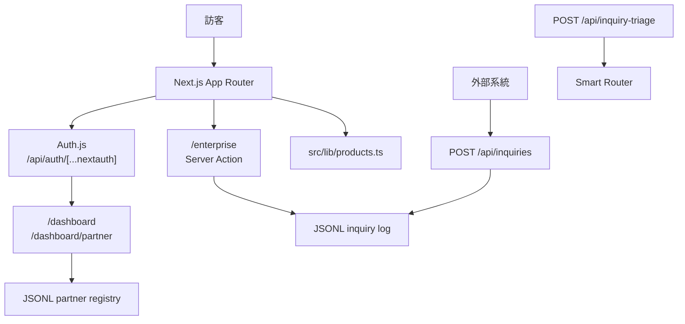

# AIBizHub TW

台灣中小企業 AI 商業工具入口站，負責產品型錄、導購、企業洽詢、介紹分潤與管理後台。狀態：程式碼內容標示 `2026 Q2` 正式上線；本 repo 未包含可驗證實際部署環境的 `vercel.json` 或部署紀錄。產品型錄目前為 3 個 `live`、3 個 `beta`。

## 總覽

AIBizHub TW 是整個產品組合的 hub。它不重複實作 QuoteKit、BeautySchedule、DocGen、TinyCRM、StayMini、Crypto Diary 等工具的核心功能，而是用 `src/lib/products.ts` 維護產品與套裝資料，並提供首頁、產品頁、定價頁、選工具精靈、企業洽詢表單、外部送單 API、登入後 dashboard、介紹夥伴後台與管理員洽詢列表。

技術上採 Next.js `16.2.4` App Router、React `19.2.4`、Auth.js v5 beta、Tailwind CSS v4。企業洽詢與夥伴 registry 目前寫入 JSONL 檔案，預設位置在 `.local/`；Smart Router 只用於 `POST /api/inquiry-triage` 的訊息分類。



## 📚 專案文件

- [系統架構](docs/ARCHITECTURE.md)：技術棧、元件關係、目錄結構與 JSONL 資料模型。
- [操作與業務流程](docs/FLOWS.md)：產品導購、企業洽詢、外部送單、登入、介紹歸因、Smart Router 分類流程。
- [頁面與路由](docs/PAGES.md)：所有頁面路由、API endpoint、Server Action 與主要模組用途。
- [安裝與維運](docs/OPERATIONS.md)：本機啟動、環境變數、Vercel 部署、健康檢查、JSONL 備份與維運注意事項。

## 快速開始

需求：Node.js 20+ 建議版本、npm。

```bash
npm install
npm run dev
```

常用 scripts 來自 `package.json`：

| 指令 | 用途 |
|---|---|
| `npm run dev` | 啟動 Next.js 開發伺服器 |
| `npm run build` | 正式建置 |
| `npm run start` | 啟動正式 server |
| `npm run lint` | 執行 ESLint |

未設定環境變數也能本機啟動：Google OAuth 會停用、Demo 登入預設開啟、洽詢資料會寫入 `.local/enterprise-inquiries.jsonl`。

## 核心功能

| 功能 | 實作位置 | 說明 |
|---|---|---|
| 產品型錄與導購 | `/`、`/products`、`/products/[slug]`、`src/lib/products.ts` | 展示 6 個外部工具與 live / GitHub 連結 |
| 定價與套裝 | `/pricing`、`src/lib/products.ts` | 單品方案與 4 種 bundle |
| 選工具精靈 | `/help/choose` | 依產業、規模、需求推薦產品或套裝 |
| 企業洽詢收單 | `/enterprise`、`src/app/enterprise/actions.ts` | 驗證表單、產生 `AIB-XXXXXXXX`、寫入 JSONL、best-effort Telegram 通知 |
| 外部送單 API | `GET/POST /api/inquiries` | 給 chatbot、widget、partner 程式化送單 |
| 洽詢分類 API | `POST /api/inquiry-triage` | 透過 Smart Router 回傳 category、urgency、suggestedReply |
| 登入 | `/login`、`src/auth.ts` | Google OAuth 可選；Demo provider 預設開啟 |
| 儀表板 | `/dashboard` | 登入後顯示產品入口、訂閱狀態、介紹連結 |
| 介紹分潤 | `/dashboard/partner`、`src/proxy.ts`、`src/lib/partner.ts` | 產生 8 碼介紹碼，`?ref=` 寫入 90 天 cookie |
| 管理後台 | `/admin/inquiries` | 讀取 inquiry JSONL，依 `AIBIZHUB_ADMIN_EMAILS` 控管 |
| 健康檢查 | `GET /api/health` | 回報 auth、通知、API、storage、runtime 狀態 |

## 串接的 6 個工具

資料來源為 `src/lib/products.ts`。

| slug | 工具 | 定位 | 狀態 |
|---|---|---|---|
| `quotekit` | QuoteKit TW | 5 分鐘出專業報價單，PDF 自動生成 | `live` |
| `beautyschedule` | BeautySchedule TW | 美業 / 教練預約系統，自助排程與提醒 | `live` |
| `docgen` | DocGen TW | 合約 / NDA / 委任書產生與兩造電子簽署 | `beta` |
| `tinycrm` | TinyCRM TW | 迷你 CRM、標籤、互動歷史、Excel 匯出 | `beta` |
| `staymini` | StayMini | 輕量民宿 / 短租訂房與雙重訂房阻擋 | `beta` |
| `investjournal` | Crypto Diary | 個人投資日記與自動化機器人 | `live` |

## 環境變數

repo 無 `.env.example`。完整說明見 [安裝與維運](docs/OPERATIONS.md)。實際使用的 env：

| 變數 | 用途 |
|---|---|
| `AUTH_SECRET` | Auth.js JWT secret；也可作 partner code salt fallback |
| `AUTH_GOOGLE_ID` / `AUTH_GOOGLE_SECRET` | 啟用 Google OAuth |
| `AIBIZHUB_DEMO_LOGIN` | 設 `0` 關閉 Demo 登入 |
| `AIBIZHUB_ADMIN_EMAILS` | admin email 白名單 |
| `AIBIZHUB_NOTIFY_TG_TOKEN` / `AIBIZHUB_NOTIFY_TG_CHAT` | Telegram 洽詢通知 |
| `AIBIZHUB_INQUIRY_API_KEYS` | `/api/inquiries` Bearer API keys |
| `AIBIZHUB_INQUIRY_LOG` | 洽詢 JSONL 路徑 |
| `AIBIZHUB_PARTNER_LOG` | 夥伴 registry JSONL 路徑 |
| `AIBIZHUB_PARTNER_SECRET` | 介紹碼 HMAC salt |
| `SMART_ROUTER_URL` | Smart Router base URL |
| `NEXT_PUBLIC_SITE_URL` | 站台公開 URL |

## 部署

現有文件與專案型態以 Vercel 為主要部署路徑。repo 沒有 Dockerfile、compose、Makefile 或 `vercel.json`。

部署重點：

1. 在 Vercel 匯入 repo，框架使用 Next.js 自動偵測。
2. 設定正式環境 env；至少建議設定 `AUTH_SECRET`。
3. 若要正式 Google 登入，設定 `AUTH_GOOGLE_ID`、`AUTH_GOOGLE_SECRET`。
4. 設定 `NEXT_PUBLIC_SITE_URL`。
5. Deploy 後呼叫 `GET /api/health` 檢查 auth、Telegram、API key 與 storage 狀態。

注意：目前 inquiry 與 partner 資料寫入 JSONL。Vercel 等 serverless filesystem 不保證持久與共享；正式保存 leads 應改接持久化資料庫或外部儲存。

## 授權

本專案為私有專案，未隨附 LICENSE 檔案。All rights reserved.
