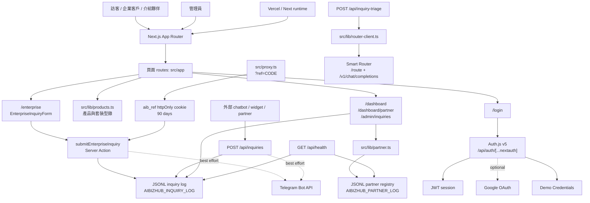
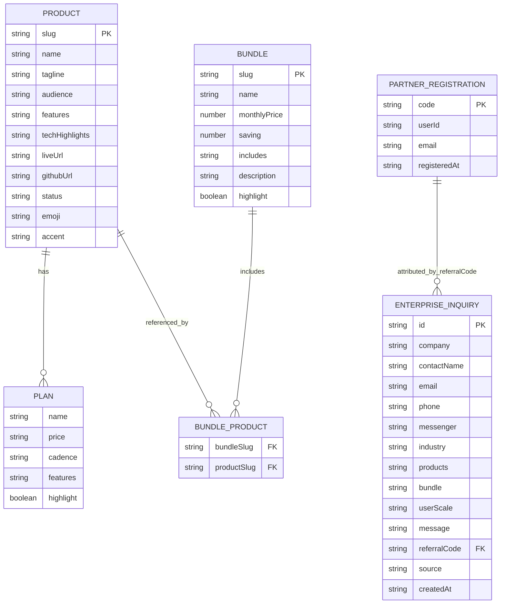

# 系統架構

## 專案總覽

AIBizHub TW 是台灣中小企業 AI 商業工具組合的入口站與導購後台。此 repo 不實作 6 個工具的核心功能，而是集中提供產品型錄、定價與套裝說明、企業洽詢收單、介紹分潤追蹤、登入後儀表板、管理員洽詢列表，以及 Smart Router 洽詢分類 API。主要使用者包含訪客、企業客戶、介紹夥伴、管理員與外部 chatbot / widget 等送單來源。

## 技術棧

| 類別 | 技術 | 來源 / 說明 |
|---|---|---|
| Framework | Next.js `16.2.4` | `package.json` dependency，App Router 結構在 `src/app` |
| UI | React `19.2.4` / React DOM `19.2.4` | `package.json` dependency |
| 語言 | TypeScript `^5` | `package.json` devDependency、`tsconfig.json` |
| 認證 | `next-auth` `^5.0.0-beta.31` | `src/auth.ts`，Auth.js v5，JWT session |
| OAuth Provider | Google OAuth | `AUTH_GOOGLE_ID`、`AUTH_GOOGLE_SECRET` 皆存在才啟用 |
| Demo Login | Credentials provider | `AIBIZHUB_DEMO_LOGIN !== "0"` 時啟用，密碼為 `demo` |
| 樣式 | Tailwind CSS `^4` / `@tailwindcss/postcss` `^4` | `postcss.config.mjs`、`src/app/globals.css` |
| 資料儲存 | JSONL 檔案 + Node `fs` | `AIBIZHUB_INQUIRY_LOG`、`AIBIZHUB_PARTNER_LOG`，預設 `.local/*.jsonl` |
| API | Next.js Route Handlers | `src/app/api/*/route.ts` |
| Server Action | React / Next.js Server Action | `src/app/enterprise/actions.ts` |
| LLM 外部服務 | Smart Router | `src/lib/router-client.ts`，呼叫 `/route` 與 `/v1/chat/completions` |
| 通知外部服務 | Telegram Bot API | 企業洽詢與 API 送單後 best-effort 通知 |
| 部署 | Next.js runtime，可部署 Vercel | repo 無 `vercel.json`、Dockerfile、compose；README 以 Vercel 為主要部署方式 |
| SEO / OG | `sitemap.ts`、`robots.ts`、`next/og` | 站台與產品頁動態產生 sitemap、robots、OG image |

> `src/lib/products.ts` 內的 `techHighlights` 描述外部工具本身，例如 Prisma、PostgreSQL、Supabase、Streamlit；這些不是本 repo 的套件依賴。

## 架構圖

## 主要目錄結構

| 路徑 | 用途 |
|---|---|
| `src/app` | Next.js App Router 頁面、API route、metadata route、OG image route |
| `src/app/api` | `auth`、`health`、`inquiries`、`inquiry-triage` API endpoints |
| `src/app/enterprise` | 企業洽詢頁面、client form、Server Action 儲存流程 |
| `src/app/dashboard` | 登入後儀表板與介紹夥伴後台 |
| `src/app/admin/inquiries` | 管理員洽詢列表，讀取 inquiry JSONL |
| `src/app/help/choose` | 三步驟選工具精靈 |
| `src/app/products` | 產品列表、產品動態頁、產品 OG image |
| `src/components` | 全站 `Nav`、`Footer`、`FloatingCta` |
| `src/lib` | 產品型錄、公司資訊、介紹碼、Smart Router client |
| `src/auth.ts` | Auth.js v5 設定與 provider 註冊 |
| `src/proxy.ts` | `?ref=` 介紹碼 cookie 寫入邏輯 |
| `public` | Next.js 範例 SVG / favicon 靜態資產 |
| `docs` | 本技術文件 |

## 資料模型概覽

本 repo 沒有 Prisma schema、SQL migration 或正式 database models。實際資料模型來自 TypeScript 型別、`src/lib/products.ts` 常數與 JSONL 紀錄格式。

### 儲存位置

| 資料 | 實作 | 預設路徑 |
|---|---|---|
| 企業洽詢 | `src/app/enterprise/actions.ts`、`src/app/api/inquiries/route.ts` append JSONL | `.local/enterprise-inquiries.jsonl` |
| 介紹夥伴註冊 | `src/lib/partner.ts` append JSONL | `.local/partner-registry.jsonl` |
| 介紹歸因 | `src/proxy.ts` 寫入 `aib_ref` cookie，洽詢時寫入 `referralCode` | cookie + inquiry JSONL |
| 產品 / 套裝型錄 | `src/lib/products.ts` 靜態常數 | git-tracked source |
