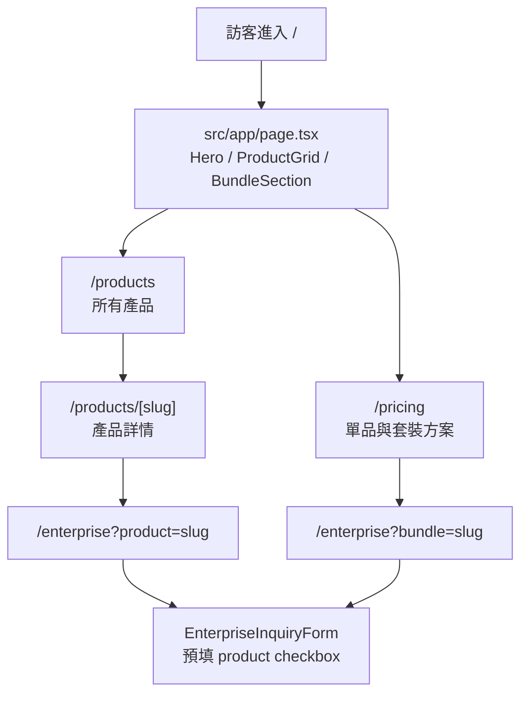
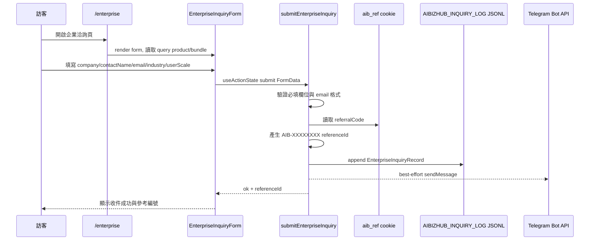
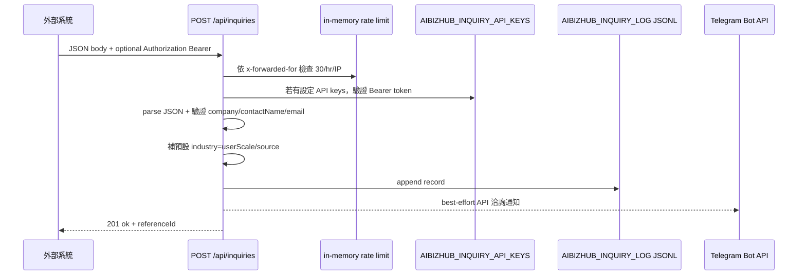
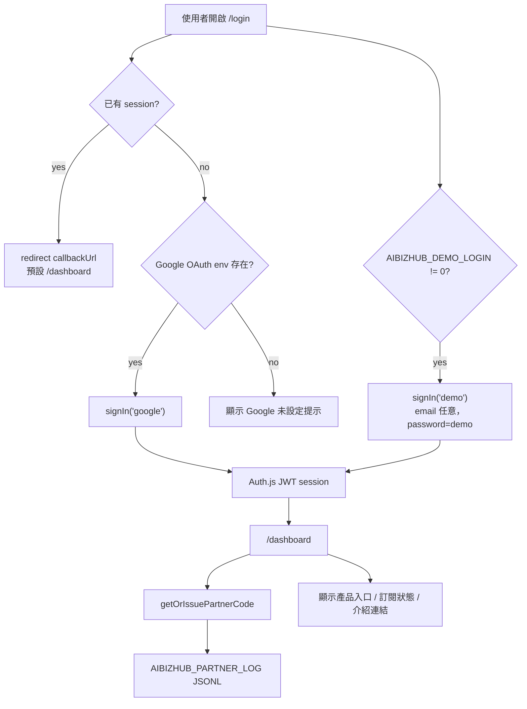
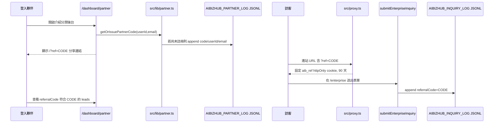
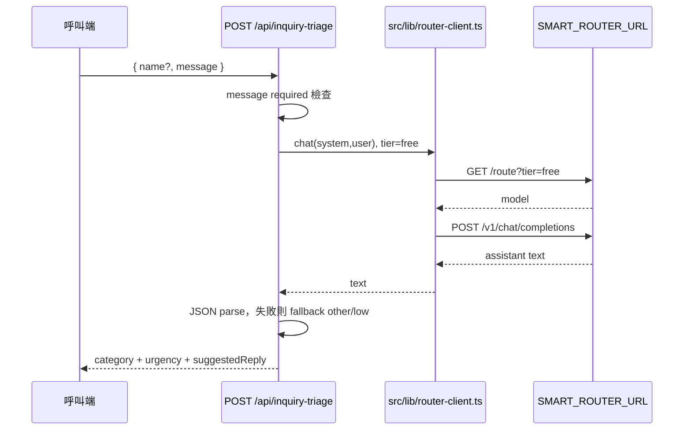

# 操作與業務流程

## 流程 1：產品探索到企業洽詢

`src/lib/products.ts` 是首頁、產品頁、定價頁與企業洽詢預填選項的共同資料來源。`/products/[slug]` 只接受 `PRODUCTS` 內的 slug；找不到時呼叫 `notFound()`。

## 流程 2：站內企業洽詢收單

必填欄位為公司名稱、聯絡人、Email、產業與使用者規模。Telegram 通知失敗不會阻擋成功路徑，JSONL 檔案才是此流程的主要資料來源。

## 流程 3：外部送單 API

`GET /api/inquiries` 會回傳欄位規格、認證狀態與 rate limit 說明。若 `AIBIZHUB_INQUIRY_API_KEYS` 未設定，POST 仍開放，但會用 process-global in-memory Map 做 IP 限流。

## 流程 4：登入與儀表板

`/dashboard` 與 `/dashboard/partner` 會在頁面內呼叫 `auth()`，沒有 session 時導向對應的 `/login?callbackUrl=...`。`src/auth.ts` 的 `authorized` callback 也以 `/dashboard` 為 protected path 判定；`/admin/inquiries` 則在頁面內另做登入與 email 白名單檢查。

## 流程 5：介紹碼歸因與夥伴後台

介紹碼由 `userId` 與 `AIBIZHUB_PARTNER_SECRET` / `AUTH_SECRET` 以 HMAC 產生 8 碼字串。歸因目前靠 cookie 與 JSONL 查詢，沒有付款或佣金自動撥款實作。

## 流程 6：洽詢自動分類

此流程只做分類與建議回覆，不會寫入 inquiry JSONL。Smart Router 失敗時 API 回傳 `502` 與錯誤訊息。
