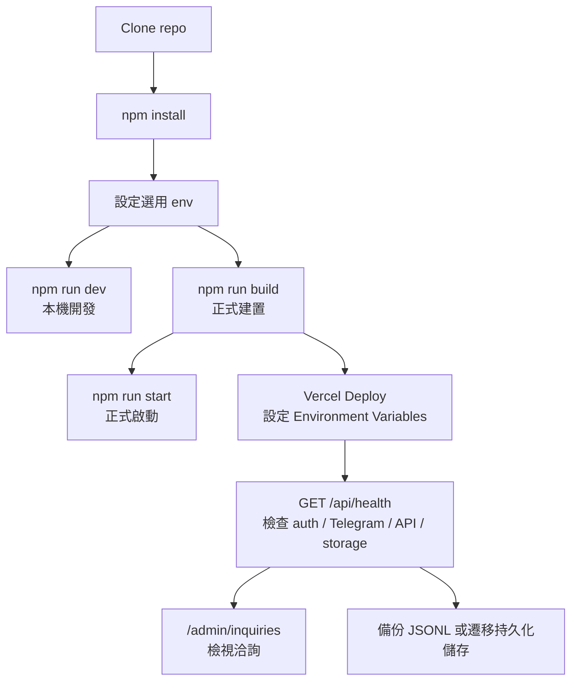

# 安裝、執行、部署、維運

## 維運總覽



## 環境需求

| 項目 | 版本 / 說明 |
|---|---|
| Node.js | 建議 Node.js 20+；repo 使用 `@types/node` `^20` |
| npm | repo 有 `package-lock.json` lockfileVersion 3，使用 npm 安裝 |
| 作業系統 | 未指定；Next.js / Node.js 可支援的環境即可 |
| 外部服務 | Google OAuth、Telegram Bot、Smart Router 皆為選用，缺少時會停用或降級 |

## 安裝與本機啟動

`package.json` 內的實際 scripts：

| 指令 | 用途 |
|---|---|
| `npm run dev` | 啟動 Next.js 開發伺服器 |
| `npm run build` | 產生正式建置 |
| `npm run start` | 啟動正式 server |
| `npm run lint` | 執行 ESLint |

快速步驟：

```bash
npm install
npm run dev
```

正式建置與啟動：

```bash
npm run build
npm run start
```

Lint：

```bash
npm run lint
```

## 環境變數

repo 內沒有 `.env.example`。以下清單由 `process.env.*` 實際使用點整理，未列任何真實密鑰值。

| 變數 | 必要性 | 使用位置 | 說明 / 預設行為 |
|---|---|---|---|
| `AUTH_SECRET` | 正式環境建議 | `src/auth.ts`、`src/lib/partner.ts`、`src/app/api/health/route.ts` | Auth.js JWT secret；partner salt 未設定時會回退使用 |
| `AUTH_GOOGLE_ID` | 選用 | `src/auth.ts`、`src/app/login/page.tsx`、`src/app/api/health/route.ts` | Google OAuth Client ID；需與 secret 同時存在才啟用 Google 登入 |
| `AUTH_GOOGLE_SECRET` | 選用 | 同上 | Google OAuth Client Secret |
| `AIBIZHUB_DEMO_LOGIN` | 選用 | `src/auth.ts`、`src/app/login/page.tsx`、`src/app/api/health/route.ts` | 設為 `0` 關閉 Demo 登入；未設時開啟 |
| `AIBIZHUB_ADMIN_EMAILS` | 選用 | `src/app/admin/inquiries/page.tsx` | 可進入 admin 洽詢列表的 email，逗號分隔；預設含一組程式碼內 email |
| `AIBIZHUB_NOTIFY_TG_TOKEN` | 選用 | `src/app/enterprise/actions.ts`、`src/app/api/inquiries/route.ts`、`src/app/api/health/route.ts` | Telegram Bot token；需與 chat id 同時存在才通知 |
| `AIBIZHUB_NOTIFY_TG_CHAT` | 選用 | 同上 | Telegram chat id |
| `AIBIZHUB_INQUIRY_API_KEYS` | 選用 | `src/app/api/inquiries/route.ts`、`src/app/api/health/route.ts` | 外部送單 API key，逗號分隔；未設時 API 開放但 IP 限流 30/hr |
| `AIBIZHUB_INQUIRY_LOG` | 選用 | enterprise action、admin、partner dashboard、inquiries API、health API | 洽詢 JSONL 路徑；預設 `.local/enterprise-inquiries.jsonl` |
| `AIBIZHUB_PARTNER_LOG` | 選用 | `src/lib/partner.ts`、`src/app/api/health/route.ts` | 介紹夥伴 registry JSONL 路徑；預設 `.local/partner-registry.jsonl` |
| `AIBIZHUB_PARTNER_SECRET` | 選用 | `src/lib/partner.ts` | 介紹碼 HMAC salt；未設時回退 `AUTH_SECRET`，再回退程式碼預設字串 |
| `SMART_ROUTER_URL` | 選用 | `src/lib/router-client.ts` | Smart Router base URL；預設 `http://127.0.0.1:8765` |
| `NEXT_PUBLIC_SITE_URL` | 選用 | dashboard、partner dashboard、sitemap、robots | 站台公開 URL；預設 `https://aibizhub.tw` |

## 部署方式

repo 未包含 `vercel.json`、Dockerfile、`docker-compose*` 或 Makefile。依現有 README 與 Next.js 專案型態，主要部署路徑是 Vercel：

1. 匯入 GitHub repo。
2. Framework 使用 Next.js 自動偵測。
3. 在 Vercel Environment Variables 設定需要的 env，正式環境至少建議設定 `AUTH_SECRET`；若要 Google 登入則加 `AUTH_GOOGLE_ID`、`AUTH_GOOGLE_SECRET`。
4. 設定 `NEXT_PUBLIC_SITE_URL` 為正式網域。
5. Deploy 後呼叫 `GET /api/health` 檢查設定狀態。

### Serverless 儲存注意

目前洽詢與夥伴資料寫入 JSONL。若部署到 Vercel 這類 serverless / ephemeral filesystem，檔案可能不持久、不共享，也不適合多 instance 寫入。正式營運若要可靠保存 leads，需把 `AIBIZHUB_INQUIRY_LOG` / `AIBIZHUB_PARTNER_LOG` 後方儲存改成持久化資料庫或外部儲存；程式碼中 `src/lib/partner.ts` 已註解提到未來可換 Prisma table。

## 常見維運操作

### 健康檢查

```bash
curl https://your-domain.example/api/health
```

回應會包含：

| 區塊 | 內容 |
|---|---|
| `auth` | Google 是否設定、Demo 是否開啟、`AUTH_SECRET` 是否存在 |
| `notifications` | Telegram 是否設定 |
| `api` | `/api/inquiries` 是否由 API key 保護 |
| `storage` | inquiry / partner JSONL 行數 |
| `runtime` | Node 版本與 process uptime |

### 檢視洽詢

1. 設定 `AIBIZHUB_ADMIN_EMAILS`。
2. 用 Google 或 Demo 登入。
3. 開啟 `/admin/inquiries`。

Demo 帳號可預覽 admin 頁；非 Demo 使用者需 email 在白名單內。

### 備份 JSONL

本機或持久化檔案系統可備份：

```bash
cp .local/enterprise-inquiries.jsonl ./backup-enterprise-inquiries.jsonl
cp .local/partner-registry.jsonl ./backup-partner-registry.jsonl
```

若 `AIBIZHUB_INQUIRY_LOG` 或 `AIBIZHUB_PARTNER_LOG` 指到自訂路徑，改備份對應路徑。

### API key 輪替

`AIBIZHUB_INQUIRY_API_KEYS` 支援逗號分隔多把 key。輪替時可短暫同時保留新舊 key，外部系統切換完成後移除舊 key。

### 關閉 Demo 登入

正式環境若不需要展示帳號，設定：

```bash
AIBIZHUB_DEMO_LOGIN=0
```

### Smart Router 維運

`POST /api/inquiry-triage` 依賴 `SMART_ROUTER_URL`。若未設定會呼叫 `http://127.0.0.1:8765`，正式環境需確認該服務可由 Next.js runtime 存取；Smart Router 失敗時 endpoint 回傳 `502`。

## Migration、seed、cron 狀態

| 項目 | repo 內狀態 |
|---|---|
| Database migration | 無 Prisma schema、SQL migration 或 migration script |
| Seed | 無 seed script |
| Cron | 無 `vercel.json` cron 或排程程式；`/api/health` 註解提到可供外部 uptime cron 使用 |
| Backup | 無自動備份 script；需手動備份 JSONL 或改接持久化儲存 |
| Docker | 無 Dockerfile / compose |
