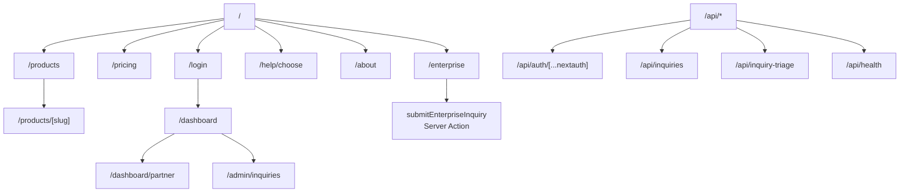

# 頁面、路由與模組清單

## 路由地圖

## 頁面路由

| 路徑 | 檔案 | 用途 | 是否需登入 |
|---|---|---|---|
| `/` | `src/app/page.tsx` | 首頁，展示 6 個工具、套裝方案與企業 CTA | 否 |
| `/about` | `src/app/about/page.tsx` | 團隊定位、技術選擇、里程碑、案例與公司聯絡資訊 | 否 |
| `/products` | `src/app/products/page.tsx` | 所有產品列表，顯示狀態、功能、價格、試用連結 | 否 |
| `/products/[slug]` | `src/app/products/[slug]/page.tsx` | 單一產品詳情、功能、技術亮點、方案與相關套裝 | 否 |
| `/pricing` | `src/app/pricing/page.tsx` | 單品方案、套裝方案、企業方案與介紹分潤說明 | 否 |
| `/enterprise` | `src/app/enterprise/page.tsx` | 企業洽詢頁，內含 `EnterpriseInquiryForm` | 否 |
| `/help/choose` | `src/app/help/choose/page.tsx` | 三步驟選工具 wizard，推薦產品或套裝 | 否 |
| `/login` | `src/app/login/page.tsx` | Google OAuth / Demo 登入入口；已登入會 redirect | 否 |
| `/dashboard` | `src/app/dashboard/page.tsx` | 登入後產品入口、訂閱狀態、介紹碼與分享連結 | 是 |
| `/dashboard/partner` | `src/app/dashboard/partner/page.tsx` | 介紹分潤後台，顯示介紹碼與歸因 leads | 是 |
| `/admin/inquiries` | `src/app/admin/inquiries/page.tsx` | 管理員洽詢列表與統計；Demo 帳號可預覽 | 是，且需 email 白名單或 Demo |
| `/opengraph-image` | `src/app/opengraph-image.tsx` | 全站 OG image route，使用 `next/og` | 否 |
| `/products/[slug]/opengraph-image` | `src/app/products/[slug]/opengraph-image.tsx` | 產品頁 OG image route | 否 |
| `/robots.txt` | `src/app/robots.ts` | robots 規則，封鎖 `/dashboard`、`/api/`、`/login` | 否 |
| `/sitemap.xml` | `src/app/sitemap.ts` | sitemap，包含首頁、產品、定價、企業、選擇工具、登入與產品詳情 | 否 |

### `/products/[slug]` 允許值

`generateStaticParams()` 來自 `PRODUCTS`：

| slug | 產品名稱 | 狀態 |
|---|---|---|
| `quotekit` | QuoteKit TW | `live` |
| `beautyschedule` | BeautySchedule TW | `live` |
| `docgen` | DocGen TW | `beta` |
| `tinycrm` | TinyCRM TW | `beta` |
| `staymini` | StayMini | `beta` |
| `investjournal` | Crypto Diary | `live` |

## API endpoint

| 方法 | 路徑 | 檔案 | 用途 | 認證 |
|---|---|---|---|---|
| `GET` | `/api/auth/[...nextauth]` | `src/app/api/auth/[...nextauth]/route.ts` | Auth.js handler | 由 Auth.js 處理 |
| `POST` | `/api/auth/[...nextauth]` | `src/app/api/auth/[...nextauth]/route.ts` | Auth.js handler | 由 Auth.js 處理 |
| `GET` | `/api/health` | `src/app/api/health/route.ts` | 健康檢查，回報 auth、通知、API、storage、runtime 狀態 | 無 |
| `GET` | `/api/inquiries` | `src/app/api/inquiries/route.ts` | 回傳送單 API 規格、欄位、auth 狀態與 rate limit | 無 |
| `POST` | `/api/inquiries` | `src/app/api/inquiries/route.ts` | 外部系統送企業洽詢，寫入 inquiry JSONL | 若 `AIBIZHUB_INQUIRY_API_KEYS` 有值則需 `Authorization: Bearer`；否則 IP 限流 |
| `POST` | `/api/inquiry-triage` | `src/app/api/inquiry-triage/route.ts` | 用 Smart Router 將訊息分類為 `sales/partner/support/spam/other` | 無 |

## Server Action

| 名稱 | 檔案 | 呼叫來源 | 用途 |
|---|---|---|---|
| `submitEnterpriseInquiry` | `src/app/enterprise/actions.ts` | `EnterpriseInquiryForm` | 驗證企業洽詢表單、產生 `AIB-XXXXXXXX`、寫入 JSONL、best-effort Telegram 通知 |

## 主要支援模組

| 模組 | 用途 |
|---|---|
| `src/auth.ts` | Auth.js v5 設定；Google provider 有 env 才註冊，Demo provider 可用 `AIBIZHUB_DEMO_LOGIN=0` 關閉 |
| `src/proxy.ts` | 將合法 `?ref=CODE` 寫入 `aib_ref` httpOnly cookie，TTL 90 天 |
| `src/lib/products.ts` | 6 個產品與 4 個套裝方案的單一資料源 |
| `src/lib/partner.ts` | 由 user id 產生穩定介紹碼、寫入 / 讀取 partner JSONL |
| `src/lib/router-client.ts` | Smart Router client，負責 route model 與 chat completions 呼叫 |
| `src/lib/company.ts` | 公司名稱、英文名、Email、地址 |
| `src/components/Nav.tsx` | 全站導覽，依 session 顯示登入或儀表板 |
| `src/components/Footer.tsx` | 全站 footer 與公司資訊 |
| `src/components/FloatingCta.tsx` | 浮動企業洽詢 CTA；在登入、dashboard、admin、enterprise、api 路徑隱藏 |
